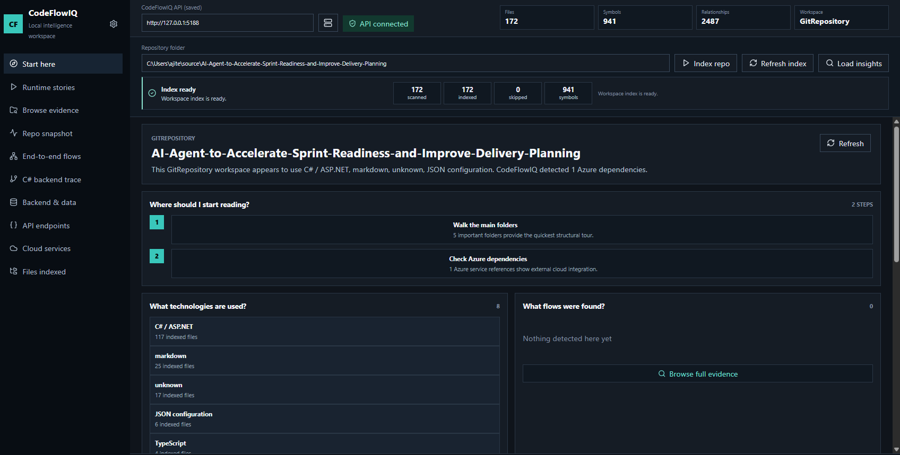
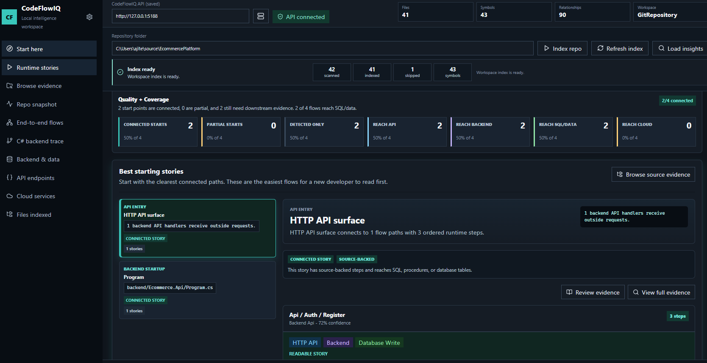
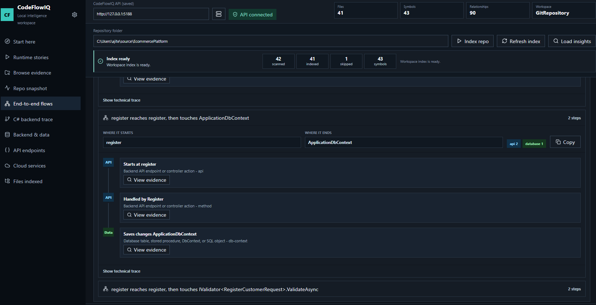
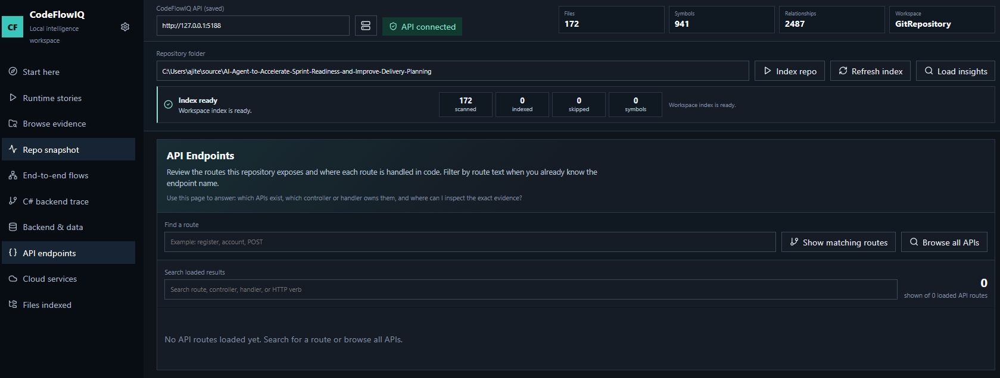
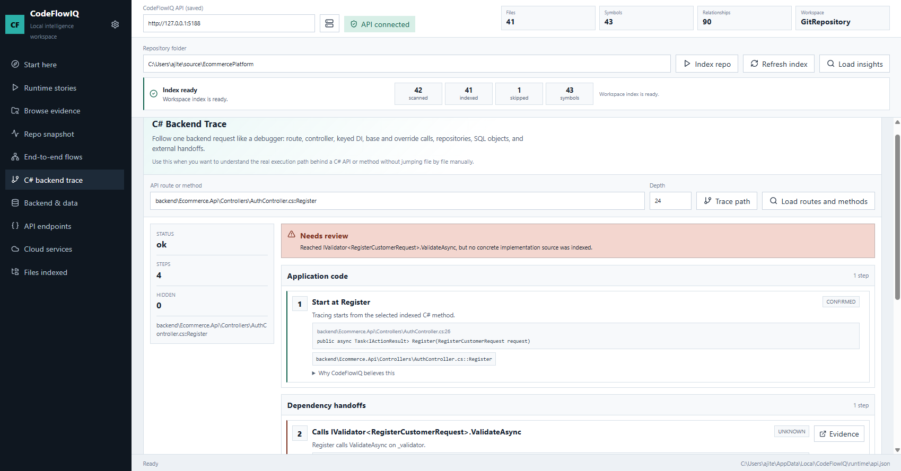

# CodeFlowIQ

[](https://dotnet.microsoft.com/)
[](https://learn.microsoft.com/dotnet/csharp/)
[](https://learn.microsoft.com/aspnet/core/)
[](https://react.dev/)
[](https://www.typescriptlang.org/)
[](https://vite.dev/)
[](https://www.sqlite.org/)
[](#what-codeflowiq-does)
[](#main-ui-areas)
[](#core-differentiators)
[](#core-differentiators)
[](#why-this-project-stands-out)

## Local-First Code Intelligence For Enterprise Repositories

**CodeFlowIQ is a local-first repository intelligence platform that helps developers understand unfamiliar codebases faster.** It indexes a local Git repository or plain folder and turns source code into a readable product experience: runtime stories, repository exploration, API discovery, backend-to-SQL tracing, Azure dependency visibility, and evidence-backed execution understanding.

Built as a serious engineering product rather than a demo dashboard, CodeFlowIQ focuses on a real developer pain point: **how do you understand a large enterprise repository without spending days hopping across files, breakpoints, API handlers, DI registrations, repositories, stored procedures, and cloud integrations?**

It is especially relevant for:

- Recruiters evaluating product-minded engineering work.
- Interviewers looking for architecture thinking, full-stack execution, and developer-tooling depth.
- Engineering leaders who care about onboarding, maintainability, and local-first analysis.
- Developers trying to answer, "Where does this request actually go?"

## Why This Project Stands Out

CodeFlowIQ is more than code search. It is a developer experience layer on top of static analysis.

- It combines **product design, frontend UX, backend architecture, analyzers, indexing, and query orchestration** in one cohesive tool.
- It is built around **real evidence**, not vague summaries.
- It treats **readability and trust** as product features.
- It supports **enterprise-style stacks** such as C#, ASP.NET Core, SQL/T-SQL, JavaScript/TypeScript, Angular, React, and Azure signals.
- It is designed to stay **local-first**, which matters for private repositories and regulated environments.

## SEO Keywords

CodeFlowIQ, code intelligence platform, repository explorer, runtime map, C# code analysis, ASP.NET Core API analysis, SQL dependency analysis, Azure dependency mapping, developer onboarding tool, local code search, static analysis platform, source evidence explorer, execution trace visualizer, enterprise codebase understanding, backend trace debugger

## Elevator Pitch

CodeFlowIQ helps a developer move from "I just cloned this repo" to "I understand the important flows, APIs, data touchpoints, and cloud dependencies" through a guided, evidence-backed UI.

Instead of throwing raw search results at the user, it answers high-value engineering questions:

- What is this repository built with?
- Where should I start reading?
- Which APIs are exposed?
- Which backend service actually handles this route?
- Which SQL tables or stored procedures are touched?
- Which Azure services are involved?
- Which parts of the flow are exact, inferred, partial, duplicated, or unresolved?

## Screenshots

### Start Here: Repository Overview



### Runtime Map: Recommended Runtime Stories



### End-to-End Flows: API to Backend/Data Paths



### API Endpoints: Route Discovery



### C# Backend Trace: Debugger-Style Execution Path



## Portfolio Value

For recruiters and interviewers, CodeFlowIQ demonstrates:

- Full-stack product engineering across `React`, `TypeScript`, `ASP.NET Core`, `C#`, indexing, and query design.
- Strong product thinking: complex analysis translated into readable workflows.
- System design maturity: analyzers, background indexing, storage, query handlers, and feature-specific UI modules.
- UX discipline: curated views, drill-down paths, evidence visibility, dark/light theme support, and large-data readability concerns.
- Enterprise empathy: local-first execution, source-backed trust, repository-scale navigation, and onboarding use cases.

## What CodeFlowIQ Does

- Indexes local Git repositories and plain local folders.
- Detects files, languages, symbols, API routes, SQL objects, Azure service usage, and source relationships.
- Builds readable Runtime Map stories from likely entry points to downstream evidence.
- Provides a full Repository Explorer for browsing files, APIs, backend/data evidence, and cloud signals.
- Traces C# backend execution through controllers, DI handoffs, concrete implementations, base methods, repositories, SQL boundaries, and unresolved calls.
- Connects frontend/API/backend/database/cloud evidence where source relationships support it.
- Keeps analysis local by default.

## Why It Exists

Large repositories are hard to understand because code search only answers narrow questions. Developers usually need the bigger execution picture:

- Which controller handles this API?
- Which manager or service is resolved by DI?
- Which repository method runs next?
- Which SQL table or stored procedure is touched?
- Which Azure service is used?
- Which evidence is exact, inferred, duplicated, partial, or unresolved?

CodeFlowIQ turns indexed repository evidence into product-shaped workflows for onboarding, debugging, impact analysis, and architecture discovery.

## Core Differentiators

- **Runtime Map instead of raw file lists**: show the most useful starting stories first.
- **Repository Explorer as a central evidence workspace**: move from preview to exact drill-down.
- **C# backend trace**: follow controller to DI to manager to repository to SQL/cloud boundaries.
- **Evidence-aware UX**: show exact, inferred, partial, duplicate, and unresolved analysis honestly.
- **Local-first architecture**: no cloud dependency required for the core experience.

## Product Documentation

- [Architecture Diagram](docs/architecture-diagram.md)
- [Sequence Diagram](docs/sequence-diagram.md)
- [Data Flow Diagram](docs/data-flow-diagram.md)
- [Product Understanding](docs/product-understanding.md)

## Supported Stacks

- C#
- ASP.NET / ASP.NET Core
- Azure Functions
- SQL / T-SQL
- JavaScript / TypeScript
- React
- Angular
- Azure service usage signals

## Main UI Areas

- **Start here**: beginner-friendly repository tour, technologies, important folders, data touchpoints, APIs, and Azure dependencies.
- **Runtime stories**: curated runtime map with recommended stories, all start points, all flows, and source evidence.
- **Browse evidence**: Repository Explorer for full indexed evidence, details, related context, grouping, and drill-down.
- **Repo snapshot**: summary of repository structure, technologies, and detected capabilities.
- **End-to-end flows**: traces feature/API paths across UI, API, backend, database, and cloud evidence.
- **C# backend trace**: debugger-style backend trace from route/controller into DI, managers, repositories, SQL, and cloud boundaries.
- **Backend & data**: backend relationships, SQL touchpoints, stored procedures, reads, and writes.
- **API endpoints**: discovered backend routes and route handlers.
- **Cloud services**: detected Azure/cloud service references.
- **Files indexed**: repository file browsing and file-level evidence.
- **Settings**: API URL, theme, and trace behavior.

## Repository Layout

```text
CodeFlowIQ/
  src/
    CodeFlowIQ.Core/        Shared contracts, query DTOs, interfaces
    CodeFlowIQ.Data/        SQLite persistence and EF migrations
    CodeFlowIQ.Analyzers/   C#, SQL/T-SQL, JS/TS, Angular analyzers
    CodeFlowIQ.Indexing/    Indexing services, query handlers, trace resolvers
    CodeFlowIQ.Git/         Git workspace detection/support
    CodeFlowIQ.Api/         Local ASP.NET Core API
    CodeFlowIQ.Cli/         CLI surface
    CodeFlowIQ.UI/          React/Vite frontend
  tests/
    CodeFlowIQ.Tests/       Integration, indexing, and query behavior tests
  docs/
    assets/screenshots/     README and product screenshots
```

## Prerequisites

Install these before running CodeFlowIQ on a new machine:

- .NET SDK compatible with the solution target framework.
- Node.js and npm for the React UI.
- Git is recommended, but target workspaces can also be plain folders.

Check local versions:

```powershell
dotnet --info
node --version
npm --version
```

## Fresh Clone Setup

Clone the repository:

```powershell
git clone <your-codeflowiq-repo-url>
cd CodeFlowIQ
```

Restore and build the .NET solution:

```powershell
dotnet restore
dotnet build
```

Install UI dependencies:

```powershell
cd src\CodeFlowIQ.UI
npm.cmd ci
cd ..\..
```

Use `npm.cmd` on Windows PowerShell. Calling `npm` directly may resolve to `npm.ps1` and hit execution-policy restrictions.

## Run CodeFlowIQ Locally

Run the API in one terminal:

```powershell
cd CodeFlowIQ
$env:CODEFLOWIQ_API_URLS='http://127.0.0.1:5188'
dotnet run --project src\CodeFlowIQ.Api\CodeFlowIQ.Api.csproj
```

Run the UI in a second terminal:

```powershell
cd CodeFlowIQ\src\CodeFlowIQ.UI
npm.cmd run dev
```

Open the UI:

```text
http://127.0.0.1:5173/
```

The UI defaults to:

```text
http://127.0.0.1:5188
```

You can also set the UI API URL before starting Vite:

```powershell
$env:VITE_CODEFLOWIQ_API_BASE_URL='http://127.0.0.1:5188'
npm.cmd run dev
```

## Check API Health

```powershell
Invoke-WebRequest -Uri 'http://127.0.0.1:5188/health' -UseBasicParsing
```

Expected response:

```json
{
  "status": "healthy",
  "name": "CodeFlowIQ.Api"
}
```

## Index A Repository

1. Start the API and UI.
2. Open `http://127.0.0.1:5173/`.
3. Enter a target workspace path, for example:

```text
C:\Users\you\source\SomeEnterpriseRepo
```

4. Click `Index repo` for a new workspace.
5. Watch background indexing progress.
6. Click `Load insights` after indexing completes.
7. Use Start Here, Runtime Map, Repository Explorer, End-to-End Flows, C# Backend Trace, API Endpoints, Backend & Data, Cloud Services, and Files Indexed to inspect the codebase.

After analyzer changes, refresh or re-index the target workspace so new relationship signals are captured.

## Important Local API Endpoints

Base URL:

```text
http://127.0.0.1:5188
```

Endpoints:

```text
GET  /health
POST /api/workspace/init
POST /api/workspace/sync
GET  /api/workspace/status
GET  /api/workspace/indexing-status
GET  /api/summary
GET  /api/overview
GET  /api/runtime-flows
GET  /api/explorer/*
GET  /api/files
GET  /api/symbols
GET  /api/relationships
GET  /api/apis
GET  /api/azure
GET  /api/flows
GET  /api/chains
GET  /api/backend
```

Example Runtime Map query:

```powershell
$path = [System.Uri]::EscapeDataString('C:\Users\you\source\SomeEnterpriseRepo')
Invoke-RestMethod -Uri "http://127.0.0.1:5188/api/runtime-flows?path=$path&take=10"
```

## Runtime Metadata

The API writes local runtime metadata here:

Windows:

```text
%LOCALAPPDATA%\CodeFlowIQ\runtime\api.json
```

macOS:

```text
~/Library/Application Support/CodeFlowIQ/runtime/api.json
```

Linux:

```text
~/.local/share/CodeFlowIQ/runtime/api.json
```

For development, prefer a stable local API port:

```powershell
$env:CODEFLOWIQ_API_URLS='http://127.0.0.1:5188'
```

## Verify The App

Run backend tests:

```powershell
cd CodeFlowIQ
dotnet test
```

Build the UI:

```powershell
cd CodeFlowIQ\src\CodeFlowIQ.UI
npm.cmd run build
```

## Troubleshooting

### API DLL Locked During Tests

If tests fail because `CodeFlowIQ.Api` is locking DLLs, stop the running API process and rerun tests.

Find the process:

```powershell
Get-Process | Where-Object { $_.ProcessName -eq 'CodeFlowIQ.Api' } | Select-Object Id,ProcessName,Path
```

Stop it:

```powershell
Stop-Process -Id <process-id>
```

### UI Cannot Reach API

Check API health:

```powershell
Invoke-WebRequest -Uri 'http://127.0.0.1:5188/health' -UseBasicParsing
```

If the API is not running, start it:

```powershell
$env:CODEFLOWIQ_API_URLS='http://127.0.0.1:5188'
dotnet run --project src\CodeFlowIQ.Api\CodeFlowIQ.Api.csproj
```

If using a non-default API port, update the UI API field or set:

```powershell
$env:VITE_CODEFLOWIQ_API_BASE_URL='http://127.0.0.1:<port>'
npm.cmd run dev
```

### `npm` Fails In PowerShell

Use `npm.cmd`:

```powershell
npm.cmd ci
npm.cmd run dev
npm.cmd run build
```

### Runtime Map Looks Incomplete

- Refresh or re-index after analyzer changes.
- Confirm the target workspace path is correct.
- Check Runtime Map quality and coverage.
- `Detected only` means CodeFlowIQ found a start point but did not connect enough downstream evidence.
- `Inferred` means the connection is useful but not as strong as exact source-backed evidence.
- Open the related row in Repository Explorer to inspect the source evidence.

## Development Principles

- Keep optional capabilities modular and turn-off-able.
- Prefer deterministic local analysis before LLM or embedding features.
- Do not require Git for core code understanding.
- Keep indexing incremental and mindful of lower-memory machines.
- Keep Runtime Map curated, searchable, and honest about coverage.
- Make Repository Explorer the central evidence workspace.
- Treat C#, SQL, frontend, and cloud traces as stack-specific features before stitching them together.

## Roadmap Direction

Near-term priorities:

1. Improve C# backend trace resolver quality for DI, keyed services, factories, base classes, repositories, SQL, and cloud handoffs.
2. Finish Repository Explorer as the central source evidence workspace.
3. Add stronger grouping, filters, pagination, and source-location jump behavior.
4. Expand stack-specific tracing for SQL and frontend after the C# trace experience is dependable.
5. Add optional local embeddings, documentation indexing, Git history, and LLM-assisted explanation as modular layers.

## License

Add the project license here when the repository is ready for distribution.
