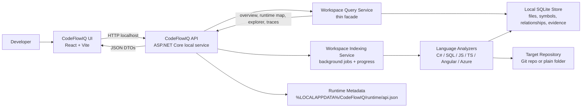

# CodeFlowIQ Architecture Diagram

CodeFlowIQ is a local-first repository intelligence workbench. It runs on a developer machine, indexes a selected repository, stores source-backed evidence locally, and exposes that evidence through a local API and React desktop-friendly UI.

## Main Runtime Responsibilities

- `CodeFlowIQ.UI`: the developer workbench, including Start Here, Runtime Map, Repository Explorer, End-to-End Flows, API Endpoints, Backend & Data, Cloud Services, Files Indexed, Settings, and C# Backend Trace.
- `CodeFlowIQ.Api`: the local HTTP API used by the UI. It owns health checks, workspace initialization, indexing job status, and query endpoints.
- `CodeFlowIQ.Indexing`: indexing orchestration, query handlers, relationship construction, and background indexing progress.
- `CodeFlowIQ.Analyzers`: source analyzers that read repository files and produce files, symbols, API routes, SQL touchpoints, Azure signals, and code relationships.
- `CodeFlowIQ.Data`: local persistence. CodeFlowIQ is intentionally local-first, so repository evidence stays on the developer machine.
- `CodeFlowIQ.Core`: shared contracts, query models, DTOs, and interfaces used across the API, indexing layer, and tests.

## Architectural Principles

- Local-first by default: source code and evidence should not require a cloud service.
- Evidence-backed views: every important UI claim should trace back to a file, symbol, route, relationship, or source preview.
- Feature modules over one large screen: each major workflow owns its UI, CSS, and domain language.
- Query handlers over one giant query file: Runtime Map, Repository Explorer, Flow Chains, C# Trace, Summary, Backend Graph, Azure, and API Surface should remain independently testable.
- Honest analysis: exact, inferred, partial, duplicate, and unresolved signals should be visible instead of hidden.
