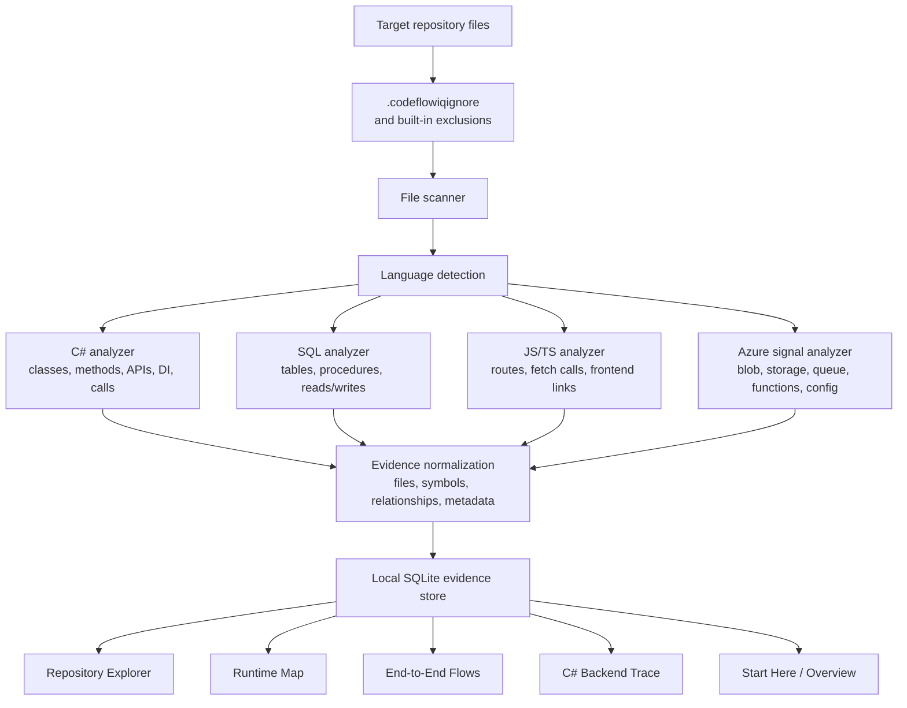

# CodeFlowIQ Data Flow Diagram

CodeFlowIQ converts repository source files into searchable evidence. The UI does not invent runtime knowledge directly; it asks backend query handlers for indexed evidence and relationship context.

## Evidence Types

- File evidence: path, extension, language, folder, and source preview.
- Symbol evidence: classes, methods, constructors, interfaces, endpoints, procedures, tables, and variables where supported.
- Relationship evidence: method calls, interface implementations, DI registrations, API route handling, SQL reads/writes, stored procedure execution, Azure service usage, and cross-file handoffs.
- Trace evidence: ordered C# backend execution steps, source previews, unresolved boundaries, hidden framework calls, and configured depth limits.
- Quality metadata: exact versus inferred evidence, duplicate occurrence count, source-backed line preview, relationship group, and missing downstream coverage.

## Data Flow Rules

- Repository source is read locally and indexed into local storage.
- UI screens query the local API; they should not parse source files directly.
- Repository Explorer is the central evidence workspace.
- Curated screens such as Runtime Map and Overview should act as readable entry points into full evidence.
- Large datasets should be paged, virtualized, grouped, or drilled into instead of rendered all at once.
