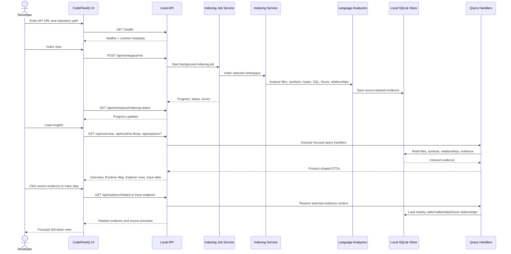

# CodeFlowIQ Sequence Diagram

This diagram shows the main developer workflow: connect the UI to the local API, index a repository, load insights, and drill into evidence.

## Important User Journeys

1. New developer opens `Start here` to understand the repository at a high level.
2. Developer opens `Runtime stories` to see curated entry points before browsing all flows.
3. Developer opens `Browse evidence` to inspect the full indexed repository without preview limits.
4. Developer opens `C# backend trace` to follow one API route through controller, DI handoff, manager, repository, SQL, and cloud boundaries.
5. Developer uses Settings to tune API URL, theme, and trace behavior without scrolling the sidebar.

## Sequence Quality Goals

- Indexing must be backgrounded and report progress.
- Long-running analysis should not freeze the UI.
- Each drill-down should land on the most exact source-backed evidence row available.
- Unresolved DI handoffs, framework calls, and inferred links should be visible to the user as analysis quality signals.
